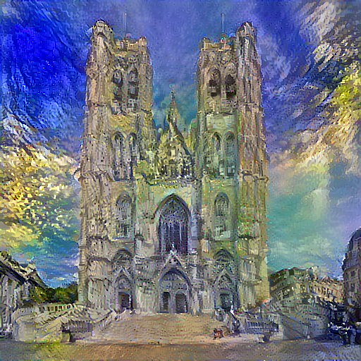

# Neural Style Transfer

Neural style transfer is a technique used to generate images in the style of another image. The neural-style algorithm takes a content-image as input, a style image, and returns the content image as if it were painted using the artistic style of the style image.
This is implemented by optimizing the output image to match the content statistics of the content image and the style statistics of the style reference image. These statistics are extracted from the images using a convolutional network architecture VGG19.

## Content image & Style image

Content image :- The Cathedral of St. Michael and St. Gudula is a medieval Roman Catholic church in central Brussels, Belgium.

Style image :-The Church at Auvers is an oil painting created by Dutch post-impressionist artist Vincent van Gogh in June 1890 which now hangs in the Musée d'Orsay in Paris, France.

## Generated image

As we can see in the generated image below which has taken artistic features from style image to into a meaningful piece of art.

### Resources

A Neural Algorithm of Artistic Style : https://arxiv.org/pdf/1508.06576.pdf

https://www.coursera.org/learn/convolutional-neural-networks/lecture/SA5H8/what-is-neural-style-transfer

https://www.tensorflow.org/tutorials/generative/style_transfer

